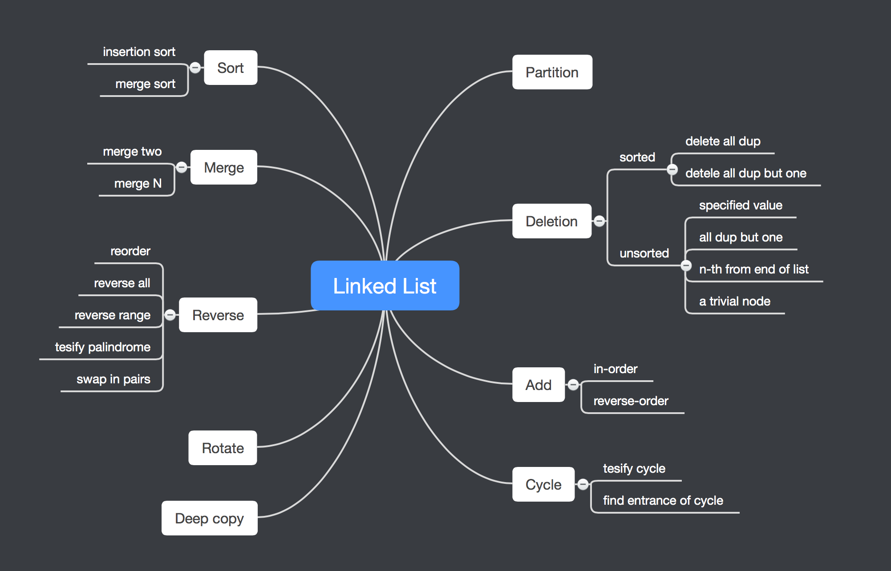

# Linked List

This section includes common operations on linked list, such as deletion, insertion, and merging.

Frequently made mistakes:

- Not updating runner-node when traversing linked list
- Not recording head node before traversing
- returning incorrect pointer to node

The image below serves as a summarization of problems in this section.

