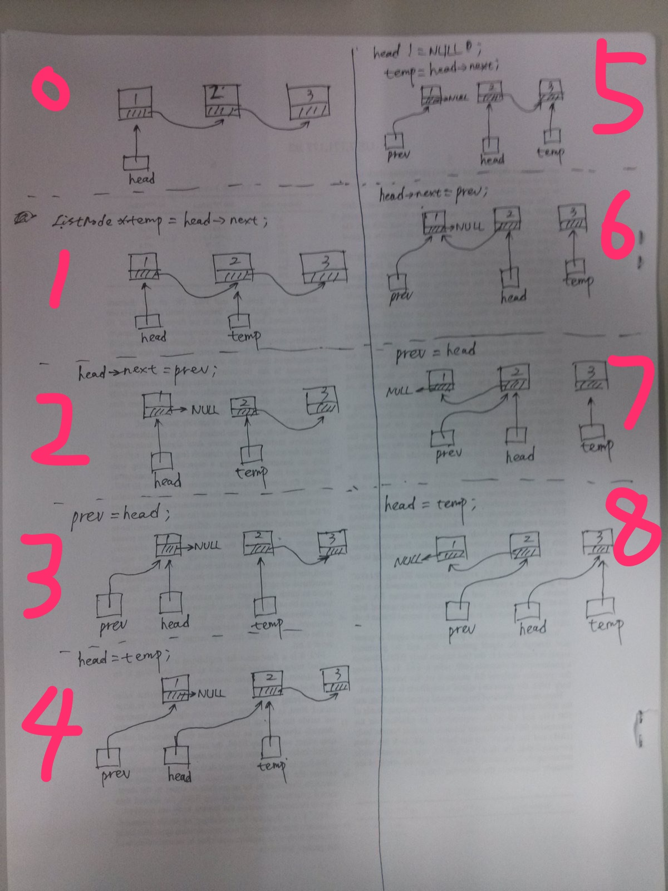

# Reverse Linked List

## Question

- leetcode: [(206) Reverse Linked List | LeetCode OJ](https://leetcode.com/problems/reverse-linked-list/)
- lintcode: [(35) Reverse Linked List](http://www.lintcode.com/en/problem/reverse-linked-list/)

```
Reverse a linked list.

Example
For linked list 1->2->3, the reversed linked list is 3->2->1

Challenge
Reverse it in-place and in one-pass
```

## Solution1 - Non-recursively

It would be much easier to reverse an array than a linked list, since array supports random access with index, while singly linked list can ONLY be operated through its head node. So an approach without index is required.

Think about how '1->2->3' can become '3->2->1'. Starting from '1', we should turn '1->2' into '2->1', then '2->3' into '3->2', and so on. The key is how to swap two adjacent nodes.

```
temp = head -> next;
head->next = prev;
prev = head;
head = temp;
```

The above code maintains two pointer, `prev` and `head`, and keeps record of next node before swapping. More detailed analysis:



1. Keep record of next node
2. change `head->next` to `prev`
3. update `prev` with `head`, to keep moving forward
4. update `head` with the record in step 1, for the sake of next loop

### Python

```python
# Definition for singly-linked list.
# class ListNode:
#     def __init__(self, x):
#         self.val = x
#         self.next = None

class Solution:
    # @param {ListNode} head
    # @return {ListNode}
    def reverseList(self, head):
        prev = None
        curr = head
        while curr is not None:
            temp = curr.next
            curr.next = prev
            prev = curr
            curr = temp
        # fix head
        head = prev

        return head
```

### C++

```c++
/**
 * Definition for singly-linked list.
 * struct ListNode {
 *     int val;
 *     ListNode *next;
 *     ListNode(int x) : val(x), next(NULL) {}
 * };
 */
class Solution {
public:
    ListNode* reverse(ListNode* head) {
        ListNode *prev = NULL;
        ListNode *curr = head;
        while (curr != NULL) {
            ListNode *temp = curr->next;
            curr->next = prev;
            prev = curr;
            curr = temp;
        }
        // fix head
        head = prev;

        return head;
    }
};
```

### Java

```java
/**
 * Definition for singly-linked list.
 * public class ListNode {
 *     int val;
 *     ListNode next;
 *     ListNode(int x) { val = x; }
 * }
 */
public class Solution {
    public ListNode reverseList(ListNode head) {
        ListNode prev = null;
        ListNode curr = head;
        while (curr != null) {
            ListNode temp = curr.next;
            curr.next = prev;
            prev = curr;
            curr = temp;
        }
        // fix head
        head = prev;

        return head;
    }
}
```

### Source Code Analysis

Already covered in the solution part. One more word, the assignment of `prev` is neat and skilled.

### Complexity

Traversing the linked list leads to ***O(n)*** time complexity, and auxiliary space complexity is ***O(1)***.

## Solution2 - Recursively

Three cases when the recursion ceases:

1. If given linked list is null, just return.
2. If given linked list has only one node, return that node.
3. If given linked list has at least two nodes, pick out the head node and regard the following nodes as a sub-linked-list, swap them, then recurse that sub-linked-list.

Be careful when swapping the head node (refer as `nodeY`) and head of the sub-linked-list (refer as `nodeX` ): First, swap `nodeY` and `nodeX`; Second, assign `null` to `nodeY->next` (or it would fall into infinite loop, and tail of result list won't point to `null`).

### Python

```python
"""
Definition of ListNode

class ListNode(object):

    def __init__(self, val, next=None):
        self.val = val
        self.next = next
"""
class Solution:
    """
    @param head: The first node of the linked list.
    @return: You should return the head of the reversed linked list.
                  Reverse it in-place.
    """
    def reverse(self, head):
        # case1: empty list
        if head is None:
            return head
        # case2: only one element list
        if head.next is None:
            return head
        # case3: reverse from the rest after head
        newHead = self.reverse(head.next)
        # reverse between head and head->next
        head.next.next = head
        # unlink list from the rest
        head.next = None

        return newHead
```

### C++

```c++
/**
 * Definition of ListNode
 *
 * class ListNode {
 * public:
 *     int val;
 *     ListNode *next;
 *
 *     ListNode(int val) {
 *         this->val = val;
 *         this->next = NULL;
 *     }
 * }
 */
class Solution {
public:
    /**
     * @param head: The first node of linked list.
     * @return: The new head of reversed linked list.
     */
    ListNode *reverse(ListNode *head) {
        // case1: empty list
        if (head == NULL) return head;
        // case2: only one element list
        if (head->next == NULL) return head;
        // case3: reverse from the rest after head
        ListNode *newHead = reverse(head->next);
        // reverse between head and head->next
        head->next->next = head;
        // unlink list from the rest
        head->next = NULL;

        return newHead;
    }
};
```

### Java

```java
/**
 * Definition for singly-linked list.
 * public class ListNode {
 *     int val;
 *     ListNode next;
 *     ListNode(int x) { val = x; }
 * }
 */
public class Solution {
    public ListNode reverse(ListNode head) {
        // case1: empty list
        if (head == null) return head;
        // case2: only one element list
        if (head.next == null) return head;
        // case3: reverse from the rest after head
        ListNode newHead = reverse(head.next);
        // reverse between head and head->next
        head.next.next = head;
        // unlink list from the rest
        head.next = null;

        return newHead;
    }
}
```

### Source Code Analysis

case1 and case2 can be combined.What case3 returns is head of reversed list, which means it is exact the same Node (tail of origin linked list) through the recursion.

### Complexity

The depth of recursion: ***O(n)***. Time Complexity: ***O(N)***. Space Complexity (without considering the recursion stack): ***O(1)***.

### Reference

- [全面分析再动手的习惯：链表的反转问题（递归和非递归方式） - 木棉和木槿 - 博客园](http://www.cnblogs.com/kubixuesheng/p/4394509.html)
- [data structures - Reversing a linked list in Java, recursively - Stack Overflow](http://stackoverflow.com/questions/354875/reversing-a-linked-list-in-java-recursively)
- [反转单向链表的四种实现（递归与非递归，C++） | 宁心勉学，慎思笃行](http://ceeji.net/blog/reserve-linked-list-cpp/)
- [iteratively and recursively Java Solution - Leetcode Discuss](https://leetcode.com/discuss/37804/iteratively-and-recursively-java-solution)
