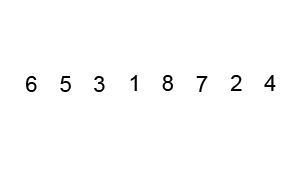

# Quick Sort - 快速排序

核心：快排是一种采用分治思想的排序算法，大致分为三个步骤。

1. 定基准——首先随机选择一个元素最为基准
2. 划分区——所有比基准小的元素置于基准左侧，比基准大的元素置于右侧
3. 递归调用——递归地调用此切分过程

## out-in-place - 非原地快排

容易实现和理解的一个方法是采用递归，使用 Python 的 list comprehension 实现如下所示：

```python
#!/usr/bin/env python


def qsort1(alist):
    print(alist)
    if len(alist) <= 1:
        return alist
    else:
        pivot = alist[0]
        return qsort1([x for x in alist[1:] if x < pivot]) + \
               [pivot] + \
               qsort1([x for x in alist[1:] if x >= pivot])

unsortedArray = [6, 5, 3, 1, 8, 7, 2, 4]
print(qsort1(unsortedArray))
```

输出如下所示：

```
[6, 5, 3, 1, 8, 7, 2, 4]
[5, 3, 1, 2, 4]
[3, 1, 2, 4]
[1, 2]
[]
[2]
[4]
[]
[8, 7]
[7]
[]
[1, 2, 3, 4, 5, 6, 7, 8]
```

『递归 + 非原地排序』的实现虽然简单易懂，但是如此一来『快速排序』便不再是最快的通用排序算法了，因为递归调用过程中非原地排序需要生成新数组，空间复杂度颇高。list comprehension 大法虽然好写，但是用在『快速排序』算法上就不是那么可取了。

### 复杂度分析

在最好情况下，快速排序的基准元素正好是整个数组的中位数，可以近似为二分，那么最好情况下递归的层数为 $$\log n$$, 咋看一下每一层的元素个数都是 $$n$$, 那么空间复杂度为 $$O(n)$$ 无疑了，不过这只答对了一半，从结论上来看是对的，但分析方法是错的。

首先来看看什么叫空间复杂度——简单来讲可以认为是程序在运行过程中所占用的存储空间大小。那么对于递归的 out-in-place 调用而言，排除函数调用等栈空间，**最好情况下，每往下递归调用一层，所需要的存储空间是上一层中的一半。完成最底层的调用后即向上返回执行出栈操作，故并不需要保存每层所有元素的值。**所以需要的总的存储空间就是
$$\sum _{i=0} ^{} \frac {n}{2^i} = 2n$$

不是特别理解的可以结合下图的非严格分析和上面 Python 的代码，递归调用的第一层保存8个元素的值，那么第二层调用时实际需要保存的其实仅为4个元素，逐层往下递归，而不是自左向右保存每一层的所有元素。

那么在最坏情况下 out-in-place 需要耗费多少额外空间呢？最坏情况下第 $$i$$ 层需要 $$i - 1$$ 次交换，故总的空间复杂度：

$$\sum_{i=0}^n (n-i+1) = O(n^2)$$


## in-place - 原地快排

### one index for partition

先来看一种简单的 in-place 实现，仍然以`[6, 5, 3, 1, 8, 7, 2, 4]`为例，结合下图进行分析。以下标 $$l$$ 和 $$u$$ 表示数组待排序部分的下界(lower bound)和上界(upper bound)，下标 $$m$$ 表示遍历到数组第 $$i$$ 个元素时当前 partition 的索引，基准元素为 $$t$$, 即图中的 target.


在遍历到第 $$i$$ 个元素时，$$x[i]$$ 有两种可能，第一种是 $$x[i] \geq t$$, $$i$$ 自增往后遍历；第二种是 $$x[i] < t$$, 此时需要将 $$x[i]$$ 置于前半部分，比较简单的实现为 `swap(x[++m], x[i])`. 直至 `i == u` 时划分阶段结束，分两截递归进行快排。既然说到递归，就不得不提递归的终止条件，容易想到递归的终止步为 `l >= u`, 即索引相等或者交叉时退出。使用 Python 的实现如下所示：

### Python

```python
#!/usr/bin/env python


def qsort2(alist, l, u):
    print(alist)
    if l >= u:
        return

    m = l
    for i in xrange(l + 1, u + 1):
        if alist[i] < alist[l]:
            m += 1
            alist[m], alist[i] = alist[i], alist[m]
    # swap between m and l after partition, important!
    alist[m], alist[l] = alist[l], alist[m]
    qsort2(alist, l, m - 1)
    qsort2(alist, m + 1, u)

unsortedArray = [6, 5, 3, 1, 8, 7, 2, 4]
print(qsort2(unsortedArray, 0, len(unsortedArray) - 1))
```

### Java

```java
public class Sort {
	public static void main(String[] args) {
		int unsortedArray[] = new int[]{6, 5, 3, 1, 8, 7, 2, 4};
		quickSort(unsortedArray);
		System.out.println("After sort: ");
		for (int item : unsortedArray) {
			System.out.print(item + " ");
		}
	}

	public static void quickSort1(int[] array, int l, int u) {
		for (int item : array) {
			System.out.print(item + " ");
		}
		System.out.println();

		if (l >= u) return;
		int m = l;
		for (int i = l + 1; i <= u; i++) {
			if (array[i] < array[l]) {
				m += 1;
				int temp = array[m];
				array[m] = array[i];
				array[i] = temp;
			}
		}
		// swap between array[m] and array[l]
		// put pivot in the mid
		int temp = array[m];
		array[m] = array[l];
		array[l] = temp;

		quickSort1(array, l, m - 1);
		quickSort1(array, m + 1, u);
	}

	public static void quickSort(int[] array) {
		quickSort1(array, 0, array.length - 1);
	}
}
```

容易出错的地方在于当前 partition 结束时未将 $$i$$ 和 $$m$$ 交换。

相应的结果输出为：

```
[6, 5, 3, 1, 8, 7, 2, 4]
[4, 5, 3, 1, 2, 6, 8, 7]
[2, 3, 1, 4, 5, 6, 8, 7]
[1, 2, 3, 4, 5, 6, 8, 7]
[1, 2, 3, 4, 5, 6, 8, 7]
[1, 2, 3, 4, 5, 6, 8, 7]
[1, 2, 3, 4, 5, 6, 8, 7]
[1, 2, 3, 4, 5, 6, 7, 8]
[1, 2, 3, 4, 5, 6, 7, 8]
```

### Two-way partitioning

对于仅使用一个索引进行 partition 操作的快排对于随机分布数列的效果还是不错的，但若数组本身就已经有序或者相等的情况下，每次划分仅能确定一个元素的最终位置，故最坏情况下的时间复杂度变为 $$O(n^2)$$. 那么有什么办法尽可能避免这种最坏情况吗？聪明的人类总是能找到更好地解决办法——使用两个索引分别向右向左进行 partition.

先来一张动图看看使用两个索引进行 partition 的过程。



1. 选中`3`作为基准
2. `lo`指针指向元素`6`, `hi`指针指向`4`, 移动`lo`直至其指向的元素大于等于`3`, 移动`hi`直至其指向的元素小于`3`。找到后交换`lo`和`hi`指向的元素——交换元素`6`和`2`。
3. `lo`递增，`hi`递减，重复步骤2，此时`lo`指向元素为`5`, `hi`指向元素为`1`. 交换元素。
4. `lo`递增，`hi`递减，发现其指向元素相同，此轮划分结束。递归排序元素`3`左右两边的元素。

对上述过程进行适当的抽象：

1. 下标 $$i$$ 和 $$j$$ 初始化为待排序数组的两端。
2. 基准元素设置为数组的第一个元素。
3. 执行 partition 操作，大循环内包含两个内循环：
   - 左侧内循环自增 $$i$$, 直到遇到**不小于**基准元素的值为止。
   - 右侧内循环自减 $$j$$, 直到遇到**小于**基准元素的值为止。
4. 大循环测试两个下标是否相等或交叉，交换其值。

这样一来对于数组元素均相等的情形下，每次 partition 恰好在中间元素，故共递归调用 $$\log n$$ 次，每层递归调用进行 partition 操作的比较次数总和近似为 $$n$$. 故总计需 $$n \log n$$ 次比较。[^programming_pearls]

可以推断出在最坏情况下，即数组本来就有序，这种方法仍然无法避免 $$O(n^2)$$ 的厄运... 即便如此，这种两边推进的方法大大提高了分区的效率，减少了 swap 的次数。

### Python

```python
#!/usr/bin/env python


def qsort3(alist, lower, upper):
    print(alist)
    if lower >= upper:
        return

    pivot = alist[lower]
    left, right = lower + 1, upper
    while left <= right:
        while left <= right and alist[left] < pivot:
            left += 1
        while left <= right and alist[right] >= pivot:
            right -= 1
        if left > right:
            break
        # swap while left <= right
        alist[left], alist[right] = alist[right], alist[left]
    # swap the smaller with pivot
    alist[lower], alist[right] = alist[right], alist[lower]

    qsort3(alist, lower, right - 1)
    qsort3(alist, right + 1, upper)

unsortedArray = [6, 5, 3, 1, 8, 7, 2, 4]
print(qsort3(unsortedArray, 0, len(unsortedArray) - 1))
```

### Java

```java
public class Sort {
	public static void main(String[] args) {
		int unsortedArray[] = new int[]{6, 5, 3, 1, 8, 7, 2, 4};
		quickSort(unsortedArray);
		System.out.println("After sort: ");
		for (int item : unsortedArray) {
			System.out.print(item + " ");
		}
	}

	public static void quickSort2(int[] array, int l, int u) {
		for (int item : array) {
			System.out.print(item + " ");
		}
		System.out.println();

		if (l >= u) return;
		int pivot = array[l];
		int left = l + 1;
		int right = u;
		while (left <= right) {
			while (left <= right && array[left] < pivot) {
				left++;
			}
			while (left <= right && array[right] >= pivot) {
				right--;
			}
			if (left > right) break;
			// swap array[left] with array[right] while left <= right
			int temp = array[left];
			array[left] = array[right];
			array[right] = temp;
		}
		/* swap the smaller with pivot */
		int temp = array[right];
		array[right] = array[l];
		array[l] = temp;

		quickSort2(array, l, right - 1);
		quickSort2(array, right + 1, u);
	}

	public static void quickSort(int[] array) {
		quickSort2(array, 0, array.length - 1);
	}
}
```

相应的输出为：

```
[6, 5, 3, 1, 8, 7, 2, 4]
[2, 5, 3, 1, 4, 6, 7, 8]
[1, 2, 3, 5, 4, 6, 7, 8]
[1, 2, 3, 5, 4, 6, 7, 8]
[1, 2, 3, 5, 4, 6, 7, 8]
[1, 2, 3, 5, 4, 6, 7, 8]
[1, 2, 3, 4, 5, 6, 7, 8]
[1, 2, 3, 4, 5, 6, 7, 8]
[1, 2, 3, 4, 5, 6, 7, 8]
[1, 2, 3, 4, 5, 6, 7, 8]
[1, 2, 3, 4, 5, 6, 7, 8]
```

从以上3种快排的实现我们可以发现其与『归并排序』的区别主要有如下两点：

1. 归并排序将数组分成两个子数组分别排序，并将有序的子数组归并以将整个数组排序。递归调用发生在处理整个数组之前。
2. 快速排序将一个数组分成两个子数组并对这两个子数组独立地排序，两个子数组有序时整个数组也就有序了。递归调用发生在处理整个数组之后。

Robert Sedgewick 在其网站上对 [Quicksort](http://algs4.cs.princeton.edu/23quicksort/) 做了较为完整的介绍，建议去围观下。

## Reference

- [快速排序 - 维基百科，自由的百科全书](http://zh.wikipedia.org/wiki/%E5%BF%AB%E9%80%9F%E6%8E%92%E5%BA%8F)
- [Quicksort |  Robert Sedgewick](http://algs4.cs.princeton.edu/23quicksort/)
- Programming Pearls Column 11 Sorting - 深入探讨了插入排序和快速排序
- [Quicksort Analysis](http://7xojrx.com1.z0.glb.clouddn.com/docs/algorithm-exercise/docs/quicksort_analysis.pdf)
- [^programming_pearls]: Programming Pearls(第二版修订版) 一书中第11章排序中注明需要 $$n\log2n$$ 次比较，翻译有误？
