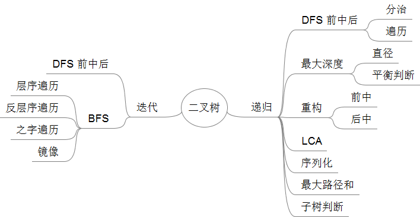

Maximum Depth of Binary Tree# Binary Tree - 二叉树

二叉树的基本概念在 [Binary Tree | Algorithm](http://algorithm.yuanbin.me/zh-hans/basics_data_structure/binary_tree.html) 中有简要的介绍，这里就二叉树的一些应用做一些实战演练。

二叉树的遍历大致可分为前序、中序、后序三种方法。

下图是把本章中所有出现的题目归类总结了一下，便于记忆

