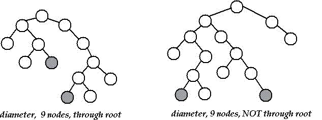

# Diameter of a Binary Tree

## Question

- [Diameter of a Binary Tree - GeeksforGeeks](http://www.geeksforgeeks.org/diameter-of-a-binary-tree/)

```
The diameter of a tree (sometimes called the width) is the number of nodes
on the longest path between two leaves in the tree.
The diagram below shows two trees each with diameter nine,
the leaves that form the ends of a longest path are shaded
(note that there is more than one path in each tree of length nine,
but no path longer than nine nodes).
```



## 题解

和题 [Lowest Common Ancestor](http://algorithm.yuanbin.me/zh-hans/binary_tree/lowest_common_ancestor.html) 分析思路特别接近。

### Java

```java
class TreeNode {
	int val;
	TreeNode left, right;
	TreeNode(int val) {
		this.val = val;
		this.left = null;
		this.right = null;
	}
}

public class Solution {
	public int diameter(TreeNode root) {
		if (root == null) return 0;

		// left, right height
		int leftHight = getHeight(root.left);
		int rightHight = getHeight(root.right);

		// left, right subtree diameter
		int leftDia = diameter(root.left);
		int rightDia = diameter(root.right);

		int maxSubDia = Math.max(leftDia, rightDia);
		return Math.max(maxSubDia, leftHight + 1 + rightHight);
	}

	private int getHeight(TreeNode root) {
		if (root == null) return 0;

		return 1 + Math.max(getHeight(root.left), getHeight(root.right));
	}

	public static void main(String[] args) {
		TreeNode root = new TreeNode(1);
		root.left = new TreeNode(2);
		root.right = new TreeNode(3);
		root.left.left = new TreeNode(4);
		root.left.right = new TreeNode(5);
		root.left.right.left = new TreeNode(6);
		root.left.right.left.right = new TreeNode(7);
		root.left.left.left = new TreeNode(8);

		Solution sol = new Solution();
		int maxDistance = sol.diameter(root);
		System.out.println("Max Distance: " + maxDistance);
	}
}
```

## Reference

- [Diameter of a Binary Tree - GeeksforGeeks](http://www.geeksforgeeks.org/diameter-of-a-binary-tree/)
- [Diameter of a Binary Tree | Algorithms](http://algorithms.tutorialhorizon.com/diameter-of-a-binary-tree/)
