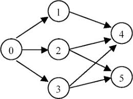

# Topological Sorting

## Problem

### Metadata

- tags: Geeks for Geeks, Topological Sort, LintCode Copyright, BFS, DFS
- difficulty: Medium
- source(lintcode): <https://www.lintcode.com/problem/topological-sorting/>
- source(geeksforgeeks): <http://www.geeksforgeeks.org/topological-sorting/>

### Description

Given an directed graph, a topological order of the graph nodes is defined as follow:

- For each directed edge `A -> B` in graph, A must before B in the order list.
- The first node in the order can be any node in the graph with no nodes direct to it.

Find any topological order for the given graph.

#### Notice

You can assume that there is at least one topological order in the graph.

#### Clarification

[Learn more about representation of graphs](http://www.lintcode.com/help/graph "Graph example")

#### Example

For graph as follow: 




The topological order can be:

    [0, 1, 2, 3, 4, 5]
    [0, 2, 3, 1, 5, 4]
    ...

#### Challenge

Can you do it in both BFS and DFS?

## 题解1 - DFS(统计节点入度数)

图搜索相关的问题较为常见的解法是用 DFS 或者 BFS，这里我们先分析一下拓扑排序的核心要求：对于有向边 `A -> B`, A 需要出现在 B 之前。用过 Linux/MAC 的人对包管理工具肯定不陌生，如 apt-get, yum, pacman, brew 等，安装一项软件时往往要先将其所有依赖的软件包安装完，拓扑排序解决的就是此类问题。这个需求实现起来大概可以分为如下几个步骤：

1. 找出不依赖其他顶点的顶点，即入度为0，这一定是符合要求的某一个拓扑排序的第一个顶点。
2. 在图中去掉入度为 0 的顶点，并重新计算一次各顶点的入度，递归调用邻居节点，迭代第一步。

在具体实现中，考虑到每次取出某个顶点时重新计算其余顶点的入度存在较多重复计算，我们可以将计算量缩减到只计算入度有变化的部分顶点，即所取出顶点的邻居节点。

### C++

```c++
/**
 * Definition for Directed graph.
 * struct DirectedGraphNode {
 *     int label;
 *     vector<DirectedGraphNode *> neighbors;
 *     DirectedGraphNode(int x) : label(x) {};
 * };
 */
class Solution {
public:
    /**
     * @param graph: A list of Directed graph node
     * @return: Any topological order for the given graph.
     */
    vector<DirectedGraphNode*> topSort(vector<DirectedGraphNode*> graph) {
        vector<DirectedGraphNode*> result;
        if (graph.size() == 0) return result;

        map<DirectedGraphNode*, int> indegree;
        // get indegree of all DirectedGraphNode
        indeg(graph, indegree);
        // dfs recursively
        for (int i = 0; i < graph.size(); ++i) {
            if (indegree[graph[i]] == 0) {
                dfs(indegree, graph[i], result);
            }
        }

        return result;
    }

private:
    /** get indegree of all DirectedGraphNode
     *
     */
    void indeg(vector<DirectedGraphNode*> &graph,
                  map<DirectedGraphNode*, int> &indegree) {

        for (int i = 0; i < graph.size(); ++i) {
            for (int j = 0; j < graph[i]->neighbors.size(); j++) {
                if (indegree.find(graph[i]->neighbors[j]) == indegree.end()) {
                    indegree[graph[i]->neighbors[j]] = 1;
                } else {
                    indegree[graph[i]->neighbors[j]] += 1;
                }
            }
        }
    }

    void dfs(map<DirectedGraphNode*, int> &indegree, DirectedGraphNode *i,
             vector<DirectedGraphNode*> &ret) {

        ret.push_back(i);
        indegree[i]--;
        for (int j = 0; j < i->neighbors.size(); ++j) {
            indegree[i->neighbors[j]]--;
            if (indegree[i->neighbors[j]] == 0) {
                dfs(indegree, i->neighbors[j], ret);
            }
        }
    }
};
```

### Java

```java
/**
 * Definition for Directed graph.
 * class DirectedGraphNode {
 *     int label;
 *     ArrayList<DirectedGraphNode> neighbors;
 *     DirectedGraphNode(int x) { label = x; neighbors = new ArrayList<DirectedGraphNode>(); }
 * };
 */

public class Solution {
    /*
     * @param graph: A list of Directed graph node
     * @return: Any topological order for the given graph.
     */
    public ArrayList<DirectedGraphNode> topSort(ArrayList<DirectedGraphNode> graph) {
        ArrayList<DirectedGraphNode> sorting = new ArrayList<>();
        Map<DirectedGraphNode, Integer> inDegreeMap = getIndegreeMap(graph);
        for (Map.Entry<DirectedGraphNode, Integer> degreeMap : inDegreeMap.entrySet()) {
            if (degreeMap.getValue() == 0) {
                dfs(inDegreeMap, degreeMap.getKey(), sorting);
            }
        }

        return sorting;
    }

    private Map<DirectedGraphNode, Integer> getIndegreeMap(ArrayList<DirectedGraphNode> graph) {
        Map<DirectedGraphNode, Integer> inDegreeMap = new HashMap<>();
        for (DirectedGraphNode node : graph) {
            inDegreeMap.putIfAbsent(node, 0);
            for (DirectedGraphNode neighbor : node.neighbors) {
                inDegreeMap.put(neighbor, inDegreeMap.getOrDefault(neighbor, 0) + 1);
            }
        }

        return inDegreeMap;
    }

    private void dfs(Map<DirectedGraphNode, Integer> inDegreeMap, DirectedGraphNode node, List<DirectedGraphNode> result) {

        result.add(node);
        inDegreeMap.put(node, inDegreeMap.get(node) - 1);
        for (DirectedGraphNode neighbor : node.neighbors) {
            inDegreeMap.put(neighbor, inDegreeMap.get(neighbor) - 1);
            if (inDegreeMap.get(neighbor) == 0) {
                dfs(inDegreeMap, neighbor, result);
            }
        }
    }
}
```

### 源码分析

C++中使用 unordered_map 可获得更高的性能，私有方法中使用引用传值。在 `dfs` 递归的过程中，将节点加入到最终结果后需要对其入度减一，否则在上层循环邻居节点时会有重复。这里的 `dfs` 是剪枝过后的 DFS, 因为这里只处理入度为 0 的节点。另外在第一次求各节点的入度数时，需要先初始化为0，否则会漏掉部分入度为0的节点。

### 复杂度分析

以 V 表示顶点数，E 表示有向图中边的条数。

首先获得节点的入度数，时间复杂度为 $$O(V+E)$$, 使用了哈希表存储，空间复杂度为 $$O(V)$$. 遍历图求得入度为0的节点，时间复杂度为 $$O(V)$$. 仅在入度为0时调用 DFS，故时间复杂度为 $$O(V+E)$$.
综上，时间复杂度近似为 $$O(V+E)$$, 空间复杂度为 $$O(V)$$.

## 题解2 - BFS

拓扑排序除了可用 DFS 求解外，也可使用 BFS, 相比题解1使用递归顺腾摸瓜获取入度为 0 的节点，我们还可以通过队列获取非邻居节点的其他入度为 0 的节点，即 BFS。具体方法为：

1. 获得图中各节点的入度。
2. BFS 首先遍历求得所有入度数为0的节点，入队，便于下一次 BFS。
3. 队列不为空时，弹出队顶元素并对其邻接节点入度数减一，将入度为0的节点加入到队列中，重复此过程直至队列为空。

### C++

```c++
/**
 * Definition for Directed graph.
 * struct DirectedGraphNode {
 *     int label;
 *     vector<DirectedGraphNode *> neighbors;
 *     DirectedGraphNode(int x) : label(x) {};
 * };
 */
class Solution {
public:
    /**
     * @param graph: A list of Directed graph node
     * @return: Any topological order for the given graph.
     */
    vector<DirectedGraphNode*> topSort(vector<DirectedGraphNode*> graph) {
        vector<DirectedGraphNode*> result;
        if (graph.size() == 0) return result;

        map<DirectedGraphNode*, int> indegree;
        // get indegree of all DirectedGraphNode
        indeg(graph, indegree);
        queue<DirectedGraphNode*> q;
        // bfs
        bfs(graph, indegree, q, result);

        return result;
    }

private:
    /** get indegree of all DirectedGraphNode
     * 
     */
    void indeg(vector<DirectedGraphNode*> &graph, 
                  map<DirectedGraphNode*, int> &indegree) {

        for (int i = 0; i < graph.size(); ++i) {
            for (int j = 0; j < graph[i]->neighbors.size(); j++) {
                if (indegree.find(graph[i]->neighbors[j]) == indegree.end()) {
                    indegree[graph[i]->neighbors[j]] = 1;
                } else {
                    indegree[graph[i]->neighbors[j]] += 1;
                }
            }
        }
    }

    void bfs(vector<DirectedGraphNode*> &graph, map<DirectedGraphNode*, int> &indegree,
             queue<DirectedGraphNode *> &q, vector<DirectedGraphNode*> &ret) {
        
        for (int i = 0; i < graph.size(); ++i) {
            if (indegree[graph[i]] == 0) {
                ret.push_back(graph[i]);
                q.push(graph[i]);
            }
        }

        while (!q.empty()) {
            DirectedGraphNode *cur = q.front();
            q.pop();
            for(int j = 0; j < cur->neighbors.size(); ++j) {
                indegree[cur->neighbors[j]]--;
                if (indegree[cur->neighbors[j]] == 0) {
                    ret.push_back(cur->neighbors[j]);
                    q.push(cur->neighbors[j]);
                }
            }
        }
    }
};
```

### Java

```java
/**
 * Definition for Directed graph.
 * class DirectedGraphNode {
 *     int label;
 *     ArrayList<DirectedGraphNode> neighbors;
 *     DirectedGraphNode(int x) { label = x; neighbors = new ArrayList<DirectedGraphNode>(); }
 * };
 */

public class Solution {
    /*
     * @param graph: A list of Directed graph node
     * @return: Any topological order for the given graph.
     */
    public ArrayList<DirectedGraphNode> topSort(ArrayList<DirectedGraphNode> graph) {
        ArrayList<DirectedGraphNode> result = new ArrayList<DirectedGraphNode>();

        if (graph == null || graph.size() == 0) return result;

        Queue<DirectedGraphNode> queue = new LinkedList<>();
        Map<DirectedGraphNode, Integer> map = getIndegreeMap(graph);
        for (Map.Entry<DirectedGraphNode, Integer> entry : map.entrySet()) {
            if (entry.getValue() == 0) {
                queue.offer(entry.getKey());
            }
        }

        bfs(queue, map, result);

        return result;
    }

    private Map<DirectedGraphNode, Integer> getIndegreeMap(ArrayList<DirectedGraphNode> graph) {
        Map<DirectedGraphNode, Integer> map = new HashMap<>();

        for (DirectedGraphNode node : graph) {
            map.putIfAbsent(node, 0);
            for (DirectedGraphNode neighbor : node.neighbors) {
                map.put(neighbor, map.getOrDefault(neighbor, 0) + 1);
            }
        }

        return map;
    }

    private void bfs(Queue<DirectedGraphNode> queue, Map<DirectedGraphNode, Integer> map, ArrayList<DirectedGraphNode> result) {

        while (!queue.isEmpty()) {
            DirectedGraphNode node = queue.poll();
            result.add(node);
            for (DirectedGraphNode neighbor : node.neighbors) {
                map.put(neighbor, map.get(neighbor) - 1);
                if (map.get(neighbor) == 0) {
                    queue.offer(neighbor);
                }
            }
        }
    }
}
```

### 源码分析

C++中在判断入度是否为0时将对 map 产生副作用，在求入度数时只有入度数大于等于1才会出现在 map 中，故不在 map 中时直接调用 indegree 方法将产生新的键值对，初始值为0，恰好满足此题需求。与 DFS 的解法不同，在 bfs 的实现中可以不对已加入到最终结果的节点入度数减一，因为没有上一层循环了。

### 复杂度分析

同题解1 的分析，时间复杂度为 $$O(V+E)$$, 空间复杂度为 $$O(V)$$.

## 题解3 - DFS(递归保证局部拓扑排序)

与题解1和题解2中依赖先计算入度数不同，这种解法可以不必事先计算入度数，从图中任意一个节点递归，直至将其所有邻接节点入栈后再对自己入栈，这样可保证有依赖的节点一定在其父节点后面出栈，遍历完图中所有节点即可得最终有效结果。这里需要借助辅助标记 Set 或者数组。具体过程可参考 GeeksforGeeks 中的视频讲解。

### Java

```java
/**
 * Definition for Directed graph.
 * class DirectedGraphNode {
 *     int label;
 *     ArrayList<DirectedGraphNode> neighbors;
 *     DirectedGraphNode(int x) { label = x; neighbors = new ArrayList<DirectedGraphNode>(); }
 * };
 */

public class Solution {
    /*
     * @param graph: A list of Directed graph node
     * @return: Any topological order for the given graph.
     */
    public ArrayList<DirectedGraphNode> topSort(ArrayList<DirectedGraphNode> graph) {
        ArrayList<DirectedGraphNode> result = new ArrayList<>();

        if (graph == null || graph.size() == 0) return result;

        Set<DirectedGraphNode> visited = new HashSet<>();
        Deque<DirectedGraphNode> stack = new ArrayDeque<>();

        for (DirectedGraphNode node : graph) {
            dfs(node, visited, stack);
        }

        while (!stack.isEmpty()) {
            result.add(stack.pop());
        }

        return result;
    }

    private void dfs(DirectedGraphNode root,
                     Set<DirectedGraphNode> visited,
                     Deque<DirectedGraphNode> stack) {

        if (!visited.contains(root)) {
            visited.add(root);
            for (DirectedGraphNode neighbor : root.neighbors) {
                dfs(neighbor, visited, stack);
            }
            stack.offerFirst(root);
        }
    }
}
```

### 源码分析

注意 Java 中栈 Stack 的使用即可，基础数据结构小节中有解析。

### 复杂度分析

同题解1 的分析，遍历所有节点所有边，时间复杂度为 $$O(V+E)$$, 空间复杂度为 $$O(V)$$.

## Reference

- [Topological Sorting 参考程序 Java/C++/Python](http://www.jiuzhang.com/solutions/topological-sorting/)
- [Topological Sorting - GeeksforGeeks](https://www.geeksforgeeks.org/topological-sorting/)
