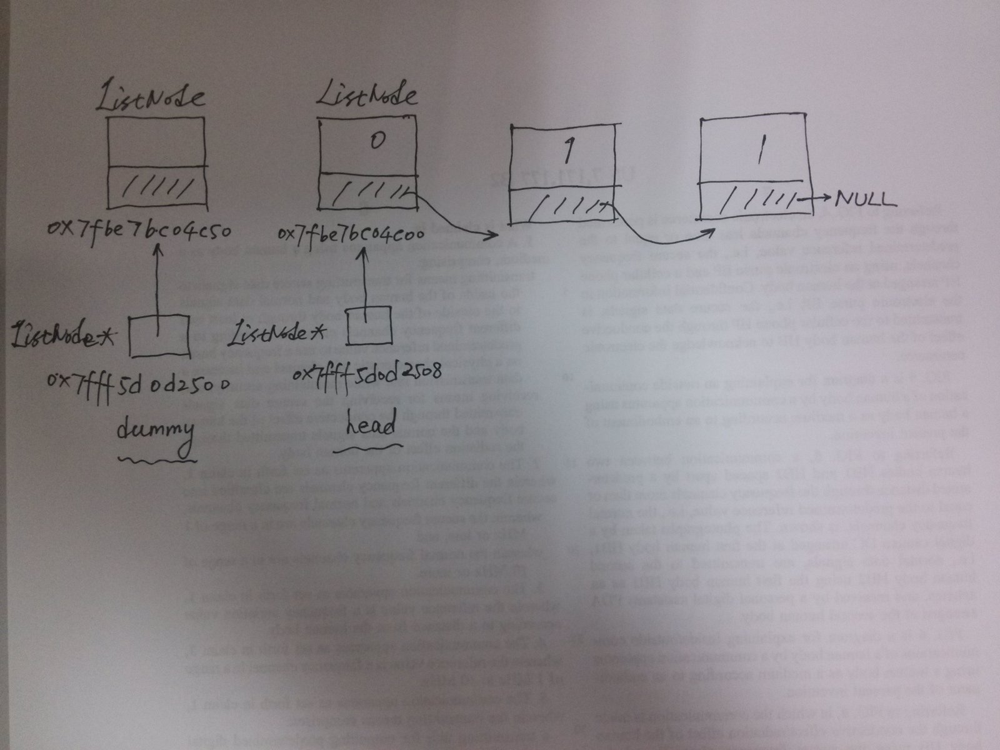

# Remove Duplicates from Sorted List II

## Question

- leetcode: [Remove Duplicates from Sorted List II | LeetCode OJ](https://leetcode.com/problems/remove-duplicates-from-sorted-list-ii/)
- lintcode: [(113) Remove Duplicates from Sorted List II](http://www.lintcode.com/en/problem/remove-duplicates-from-sorted-list-ii/)

### Problem Statement

Given a sorted linked list, delete all nodes that have duplicate numbers,
leaving only _distinct_ numbers from the original list.

#### Example

Given `1->2->3->3->4->4->5`, return `1->2->5`.  
Given `1->1->1->2->3`, return `2->3`.


## 题解

上题为保留重复值节点的一个，这题删除全部重复节点，看似区别不大，但是考虑到链表头不确定(可能被删除，也可能保留)，因此若用传统方式需要较多的if条件语句。这里介绍一个**处理链表头节点不确定的方法——引入dummy node.**

```
ListNode *dummy = new ListNode(0);
dummy->next = head;
ListNode *node = dummy;
```

引入新的指针变量`dummy`，并将其next变量赋值为head，考虑到原来的链表头节点可能被删除，故应该从dummy处开始处理，这里复用了head变量。考虑链表`A->B->C`，删除B时，需要处理和考虑的是A和C，将A的next指向C。如果从空间使用效率考虑，可以使用head代替以上的node，含义一样，node比较好理解点。

与上题不同的是，由于此题引入了新的节点`dummy`，不可再使用`node->val == node->next->val`，原因有二：

1. 此题需要将值相等的节点全部删掉，而删除链表的操作与节点前后两个节点都有关系，故需要涉及三个链表节点。且删除单向链表节点时不能删除当前节点，只能改变当前节点的`next`指向的节点。
2. 在判断val是否相等时需先确定`node->next`和`node->next->next`均不为空，否则不可对其进行取值。

说多了都是泪，先看看我的错误实现：

### C++ - Wrong

```
/**
 * Definition of ListNode
 * class ListNode {
 * public:
 *     int val;
 *     ListNode *next;
 *     ListNode(int val) {
 *         this->val = val;
 *         this->next = NULL;
 *     }
 * }
 */
class Solution{
public:
    /**
     * @param head: The first node of linked list.
     * @return: head node
     */
    ListNode * deleteDuplicates(ListNode *head) {
        if (head == NULL || head->next == NULL) {
            return NULL;
        }

        ListNode *dummy;
        dummy->next = head;
        ListNode *node = dummy;

        while (node->next != NULL && node->next->next != NULL) {
            if (node->next->val == node->next->next->val) {
                int val = node->next->val;
                while (node->next != NULL && val == node->next->val) {
                    ListNode *temp = node->next;
                    node->next = node->next->next;
                    delete temp;
                }
            } else {
                node->next = node->next->next;
            }
        }

        return dummy->next;
    }
};
```

### 错因分析

错在什么地方？

1. 节点dummy的初始化有问题，对类的初始化应该使用`new`
2. 在else语句中`node->next = node->next->next;`改写了`dummy-next`中的内容，返回的`dummy-next`不再是队首元素，而是队尾元素。原因很微妙，应该使用`node = node->next;`，node代表节点指针变量，而node->next代表当前节点所指向的下一节点地址。具体分析可自行在纸上画图分析，可对指针和链表的理解又加深不少。



图中上半部分为ListNode的内存示意图，每个框底下为其内存地址。`dummy`指针变量本身的地址为ox7fff5d0d2500，其保存着指针变量值为0x7fbe7bc04c50. `head`指针变量本身的地址为ox7fff5d0d2508，其保存着指针变量值为0x7fbe7bc04c00.

好了，接下来看看正确实现及解析。

### Python

```python
# Definition for singly-linked list.
# class ListNode:
#     def __init__(self, x):
#         self.val = x
#         self.next = None

class Solution:
    # @param {ListNode} head
    # @return {ListNode}
    def deleteDuplicates(self, head):
        if head is None:
            return None

        dummy = ListNode(0)
        dummy.next = head
        node = dummy
        while node.next is not None and node.next.next is not None:
            if node.next.val == node.next.next.val:
                val_prev = node.next.val
                while node.next is not None and node.next.val == val_prev:
                    node.next = node.next.next
            else:
                node = node.next

        return dummy.next
```

### C++

```c++
/**
 * Definition for singly-linked list.
 * struct ListNode {
 *     int val;
 *     ListNode *next;
 *     ListNode(int x) : val(x), next(NULL) {}
 * };
 */
class Solution {
public:
    ListNode* deleteDuplicates(ListNode* head) {
        if (head == NULL) return NULL;
        
        ListNode dummy(0);
        dummy.next = head;
        ListNode *node = &dummy;
        while (node->next != NULL && node->next->next != NULL) {
            if (node->next->val == node->next->next->val) {
                int val_prev = node->next->val;
                // remove ListNode node->next
                while (node->next != NULL && val_prev == node->next->val) {
                    ListNode *temp = node->next;
                    node->next = node->next->next;
                    delete temp;
                }
            } else {
                node = node->next;
            }
        }
        
        return dummy.next;
    }
};
```

### Java

```java
/**
 * Definition for singly-linked list.
 * public class ListNode {
 *     int val;
 *     ListNode next;
 *     ListNode(int x) { val = x; }
 * }
 */
public class Solution {
    public ListNode deleteDuplicates(ListNode head) {
        if (head == null) return null;

        ListNode dummy = new ListNode(0);
        dummy.next = head;
        ListNode node = dummy;
        while(node.next != null && node.next.next != null) {
            if (node.next.val == node.next.next.val) {
                int val_prev = node.next.val;
                while (node.next != null && node.next.val == val_prev) {
                    node.next = node.next.next;
                }
            } else {
                node = node.next;
            }
        }

        return dummy.next;
    }
}
```

### 源码分析

1. 首先考虑异常情况，head 为 NULL 时返回 NULL
2. new一个dummy变量，`dummy->next`指向原链表头。(C++中最好不要使用 new 的方式生成 dummy, 否则会有内存泄露)
3. 使用新变量node并设置其为dummy头节点，遍历用。
4. 当前节点和下一节点val相同时先保存当前值，便于while循环终止条件判断和删除节点。注意这一段代码也比较精炼。
5. 最后返回`dummy->next`，即题目所要求的头节点。

Python 中也可不使用`is not None`判断，但是效率会低一点。

### 复杂度分析

两根指针(node.next 和 node.next.next)遍历，时间复杂度为 $$O(2n)$$. 使用了一个 dummy 和中间缓存变量，空间复杂度近似为 $$O(1)$$.

## Reference

- [Remove Duplicates from Sorted List II | 九章](http://www.jiuzhang.com/solutions/remove-duplicates-from-sorted-list-ii/)
