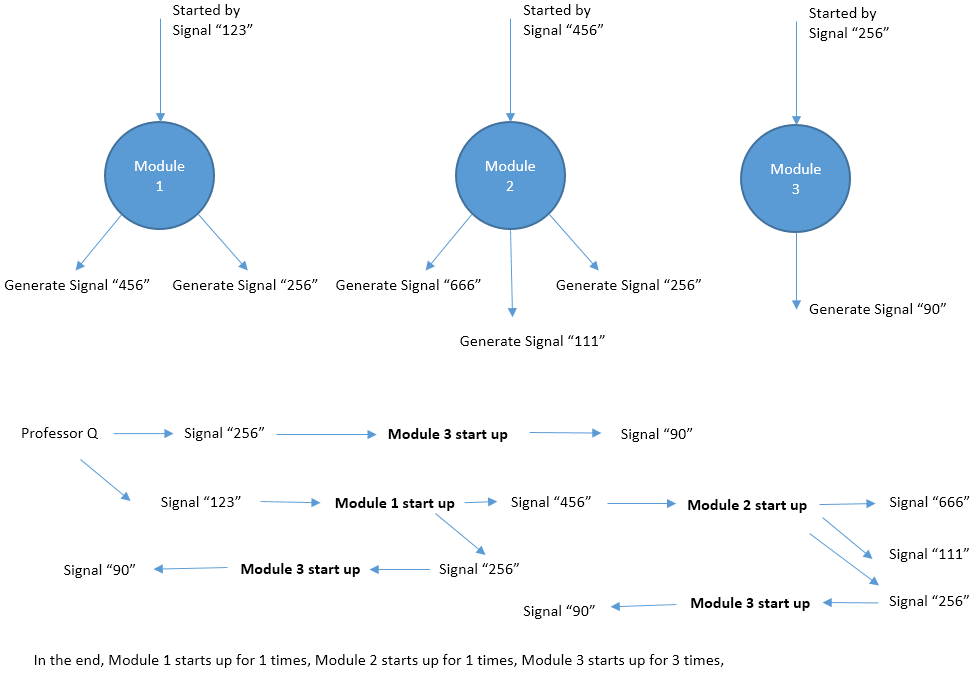

# Problem B. Professor Q's Software

## Source

- [hihoCoder](http://hihocoder.com/contest/mstest2015april/problem/2)

### Problem

时间限制:10000ms

单点时限:1000ms

内存限制:256MB

### 描述

Professor Q develops a new software. The software consists of N modules which
are numbered from 1 to N. The i-th module will be started up by signal Si. If
signal Si is generated multiple times, the i-th module will also be started
multiple times. Two different modules may be started up by the same signal.
During its lifecircle, the i-th module will generate Ki signals: E1, E2, ...,
EKi. These signals may start up other modules and so on. Fortunately the
software is so carefully designed that **there is no loop in the starting
chain of modules**, which means eventually all the modules will be stoped.
Professor Q generates some initial signals and want to know how many times
each module is started.

### 输入

The first line contains an integer T, the number of test cases. T test cases
follows.

For each test case, the first line contains contains two numbers N and M,
indicating the number of modules and number of signals that Professor Q
generates initially.

The second line contains M integers, indicating the signals that Professor Q
generates initially.

Line 3~N + 2, each line describes an module, following the format S, K, E1,
E2, ... , EK. S represents the signal that start up this module. K represents
the total amount of signals that are generated during the lifecircle of this
module. And E1 ... EK are these signals.

For 20% data, all N, M &lt;= 10
For 40% data, all N, M &lt;= 103
For 100% data, all 1 &lt;= T &lt;= 5, N, M &lt;= 105, 0 &lt;= K &lt;= 3, 0
&lt;= S, E &lt;= 105.

**Hint: HUGE input in this problem. Fast IO such as scanf and BufferedReader are recommended.**

### 输出

For each test case, output a line with N numbers Ans1, Ans2, ... , AnsN. Ansi
is the number of times that the i-th module is started. In case the answers
may be too large, output the answers modulo 142857 (the remainder of division
by 142857).

样例输入

    3
    3 2
    123 256
    123 2 456 256
    456 3 666 111 256
    256 1 90
    3 1
    100
    100 2 200 200
    200 1 300
    200 0
    5 1
    1
    1 2 2 3
    2 2 3 4
    3 2 4 5
    4 2 5 6
    5 2 6 7

样例输出

    1 1 3
    1 2 2
    1 1 2 3 5

