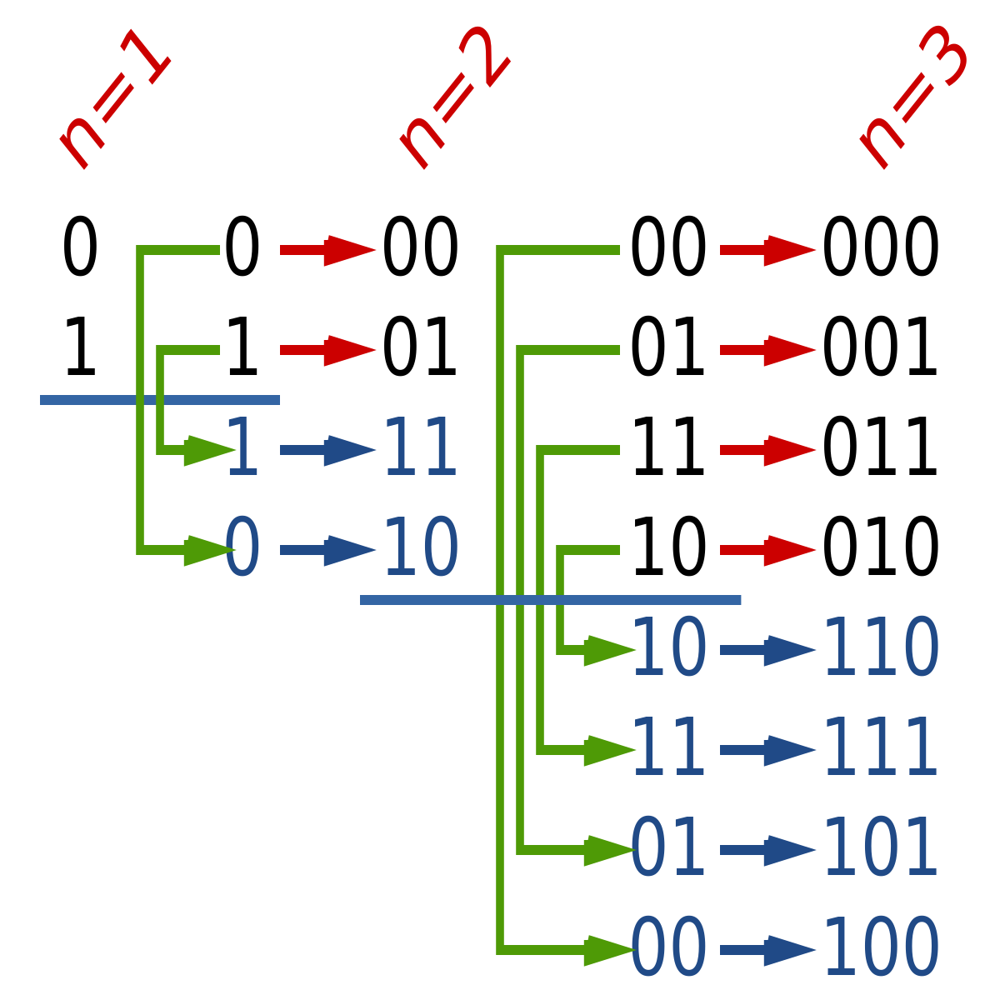

# Gray Code

## Question

- leetcode: [Gray Code | LeetCode OJ](https://leetcode.com/problems/gray-code/)
- lintcode: [(411) Gray Code](http://www.lintcode.com/en/problem/gray-code/)

### Problem Statement

The gray code is a binary numeral system where two successive values differ in only one bit.
Given a non-negative integer n representing the total number of bits in the code, find the sequence of gray code. A gray code sequence must begin with 0 and with cover all $$2^n$$ integers.

#### Example

Given `n = 2`, return `[0,1,3,2]`. Its gray code sequence is:

```
00 - 0
01 - 1
11 - 3
10 - 2
```

#### Note

For a given n, a gray code sequence is not uniquely defined.

`[0,2,3,1]` is also a valid gray code sequence according to the above definition.

#### Challenge

$$O(2^n)$$ time.

## 题解

第一次遇到这个题是在腾讯的在线笔试中，当时找到了规律，用的是递归，但是实现似乎有点问题... 直接从 n 位的格雷码分析不太好分析，比如题中`n = 2`的格雷码，我们不妨试试从小到大分析，以 `n = 1` 往后递推。



从图中我们可以看出n 位的格雷码可由 n-1位的格雷码递推，在最高位前顺序加0，逆序加1即可。实际实现时我们可以省掉在最高位加0的过程，因为其在数值上和前 n-1位格雷码相同。另外一点则是初始化的处理，图中为从1开始，但若从0开始可进一步简化程序。而且根据 [格雷码](https://zh.wikipedia.org/wiki/%E6%A0%BC%E9%9B%B7%E7%A0%81) 的定义，n=0时确实应该返回0.

### Java

```java
public class Solution {
    /**
     * @param n a number
     * @return Gray code
     */
    public ArrayList<Integer> grayCode(int n) {
        if (n < 0) return null;

        ArrayList<Integer> currGray = new ArrayList<Integer>();
        currGray.add(0);

        for (int i = 0; i < n; i++) {
            int msb = 1 << i;
            // backward - symmetry
            for (int j = currGray.size() - 1; j >= 0; j--) {
                currGray.add(msb | currGray.get(j));
            }
        }

        return currGray;
    }
}
```

### 源码分析

加0 的那一部分已经在前一组格雷码中出现，故只需将前一组格雷码镜像后在最高位加1即可。第二重 for 循环中需要注意的是`currGray.size() - 1`并不是常量，只能用于给 j 初始化。本应该使用 $$2^n$$ 和上一组格雷码相加，这里考虑到最高位为1的特殊性，使用位运算模拟加法更好。

### 复杂度分析

生成n 位的二进制码，时间复杂度 $$O(2^n)$$, 使用了`msb`代表最高位的值便于后续相加，空间复杂度 $$O(1)$$.

## Reference

- Soulmachine 的 leetcode 题解
